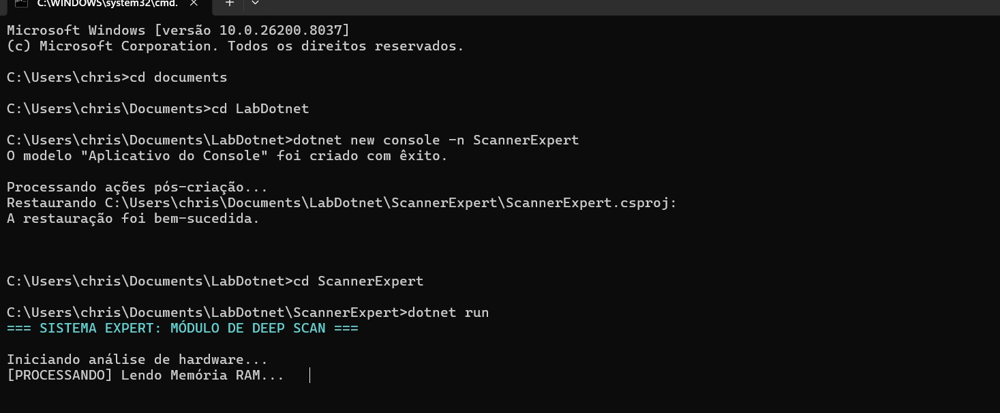

# 🚀 Scanner de Sistema com .NET

Este projeto simula um sistema de análise em tempo real utilizando o terminal.

## 🧠 Heurística aplicada
Este sistema aplica a **1ª Heurística de Nielsen: Visibilidade do Status do Sistema**.

Ou seja, o usuário sempre sabe o que está acontecendo através das mensagens de progresso:

- [PROCESSANDO] Verificando CPU...
- [PROCESSANDO] Lendo Memória...
- etc.

## ⚙️ Tecnologias utilizadas
- C#
- .NET CLI

## 📸 Evidência

